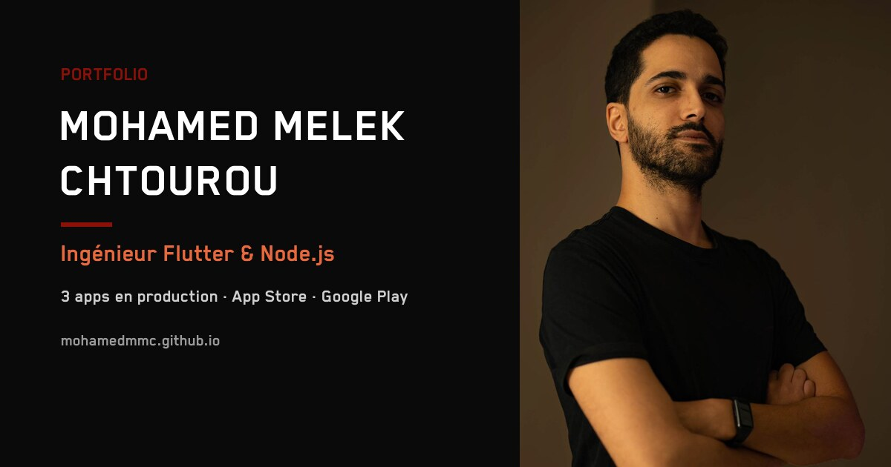

<div align="center">

# Mohamed Melek Chtourou — Portfolio

**Flutter & Node.js Engineer — 3 apps shipped to production**

[](https://mohamedmelekchtourou.com)
[](https://mohamedmmc.github.io)
[](#-features)
[](.github/workflows/deploy.yml)



</div>

---

## 📖 About

Personal portfolio of **Mohamed Melek Chtourou**, a software engineer specialized in
mobile (**Flutter**) and backend (**Node.js**) development. Bilingual (🇫🇷 / 🇬🇧), dark
"cyber" aesthetic, animated particle hero, and detailed case-study pages for each project.

Built as a **static site** (no framework, no build step) so it stays fast, portable and
trivial to host.

## ✨ Features

- **Bilingual FR / EN** — runtime i18n via `data-i18n` attributes and a single
  `translations.js` dictionary (no page reload), with a glitch transition on switch.
- **Animated hero** — custom `<canvas>` particle network + typing effect, both
  frame-rate-independent and gated behind `prefers-reduced-motion`.
- **Project case studies** — per-project pages with hero stats, architecture diagrams,
  device-mockup galleries (accessible lightbox) and live/store/repo links.
- **Performance-minded** — WebP imagery, lazy loading, `aspect-ratio` to avoid layout
  shift; total image weight kept under ~5 MB.
- **Accessible** — keyboard-operable gallery & modals (`role="dialog"`, focus trap,
  Esc), `aria-label`s, reduced-motion support.
- **SEO ready** — per-page meta, Open Graph (1200×630), Twitter cards, JSON-LD
  (`Person` + `SoftwareApplication`), `sitemap.xml`, `robots.txt`, hreflang.

## 🧰 Tech stack

| | |
|---|---|
| **Markup / style** | HTML5, CSS3 (custom properties, Flexbox/Grid), Bootstrap grid |
| **Scripts** | Vanilla JavaScript (ES6+), jQuery (legacy), Canvas API |
| **Fonts** | BlenderPro ("Cyber" display), Montserrat |
| **Analytics** | Google Analytics (gtag) |
| **CI/CD** | GitHub Actions → FTP deploy to OVH |

## 🚀 Featured projects

| Project | Description | Stack | Status |
|---|---|---|---|
| **The Landlord** | Real-estate rental platform — **146K active users**, 19 business modules | Flutter · Node.js · MySQL · Redis · Socket.io · Docker | 🟢 In production |
| **Lost & Found** | Lost-items app (App Store · Google Play · Huawei) | Swift · Kotlin · Node.js | 🟢 In production |
| **Artisan d'Art** | Full-stack artisan marketplace (iOS + React dashboard + 60+ endpoint API) | SwiftUI · React · Node.js | 🎓 Academic |
| **Tesa** | Sports-tournament management with Challonge API | Flutter · Node.js · MySQL | 👤 Personal |
| **Randev** | B2B appointment management | Flutter · Spring Boot | 🎓 Academic |
| **Esprit App** | Native iOS campus app | Swift · UIKit · MapKit | 🎓 Academic |

## 📁 Project structure

```
.
├── index.html              # Home (hero, about, experience, skills, projects)
├── pages/projects/         # One case-study page per project
├── assets/
│   ├── css/style.css       # Single stylesheet (design tokens in :root)
│   ├── js/
│   │   ├── main.js         # Particle canvas + typing animation
│   │   ├── translations.js # FR/EN dictionary + LanguageManager
│   │   ├── navbar.js        ├── footer.js   # Injected components
│   │   └── gallery.js      # Shared accessible lightbox
│   ├── img/                # Logos, project screenshots (WebP), OG cover, icons
│   ├── cv/                 # CV PDFs (Design + ATS versions)
│   ├── fonts/ · lib/       # BlenderPro font · Bootstrap/jQuery/Font Awesome
├── .github/workflows/deploy.yml   # CI/CD to OVH
├── sitemap.xml · robots.txt · site.webmanifest
```

## 💻 Run locally

No build step — it's a static site. Serve the folder with any static server:

```bash
# Python
python3 -m http.server 8000

# or Node
npx serve .
```

Then open <http://localhost:8000>.

## 🌐 Deployment

Pushing to **`main`** triggers [`.github/workflows/deploy.yml`](.github/workflows/deploy.yml),
which deploys over FTP to the OVH server (`/www/portfolio/`) serving
[mohamedmelekchtourou.com](https://mohamedmelekchtourou.com). Other branches do **not** deploy.

## 📫 Contact

- **Email** — <mohamedmelek.chtourou@gmail.com>
- **LinkedIn** — [linkedin.com/in/mohamedmelekchtourou](https://www.linkedin.com/in/mohamedmelekchtourou/)
- **GitHub** — [github.com/mohamedmmc](https://github.com/mohamedmmc)

<div align="center"><sub>© Mohamed Melek Chtourou — Flutter &amp; Node.js Engineer.</sub></div>
